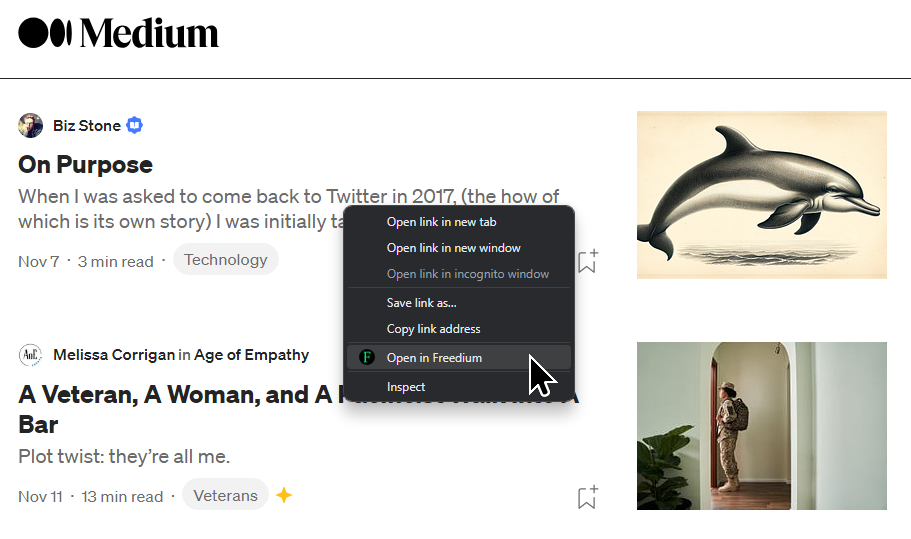

# freedium-browser-extension

### https://github.com/wywywywy/freedium-browser-extension

A browser extension to quickly open Medium articles in [Freedium](https://freedium.cfd) to bypass paywall.

Simply right click on any Medium link, or right click on anywhere in a Medium article page, and then click on "Open in Freedium".

You can also go to the Options page and add custom patterns in addition to "medium.com".

### Load the extension:
1. chrome://extensions/
2. Load unpacked
3. Select the folder
